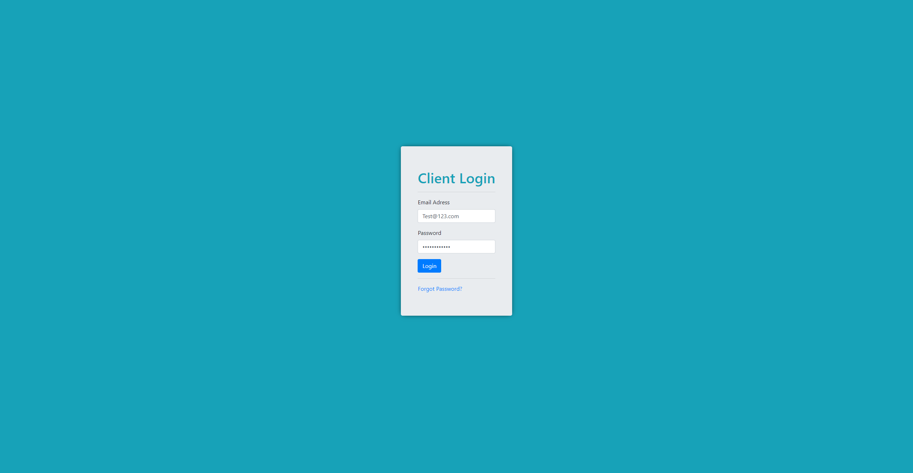

# Customer Relationship Management Ticket-System

Ticket system web app the tracks help tickets

## CRM is an abbreviation for customer relationship management, a method for managing a company's interaction with current and potential customers, and storing and analyzing data about past interactions. Management consulting company Bain defines CRM as "a process companies use to understand their customer groups and respond quickly—and at times, instantly—to shifting customer desires." But CRM can mean both the process and philosophy for meeting those goals, and the technology used to implement that process.

## Available Scripts

In the project directory, you can run:

### `npm start`

Runs the app in the development mode.\

Open [http://localhost:3000](http://localhost:3000) to view it in the browser.

Use ROBO 3T To verify your email in the backend by setting the false value to true.

Enter http://localhost:3000/dashboard in the browser to skip login and view main dashboard.

## Screenshot of login landing page

 

 

The page will reload if you make edits.
You will also see any lint errors in the console.

### `npm test`

Launches the test runner in the interactive watch mode.\
See the section about [running tests](https://facebook.github.io/create-react-app/docs/running-tests) for more information.

# CRM Server API

## How to use

- run `git clone https://github.com/ChrisAs/CRM-Ticket-System.git`
- run `npm install`
- run `npm start`

Note: Make sure you have nodemon is installed in your system otherwise you can install as a dev dependencies in the project.

## API Resources

### User API Resources

All the user API router follows `/v1/user/`

| #   | Routers                           | Verbs | Progress | Is Private | Description                                      |
| --- | --------------------------------- | ----- | -------- | ---------- | ------------------------------------------------ |
| 1   | `/v1/user/login`                  | POST  | Done     | No         | Verify user Authentication and return JWT        |
| 2   | `/v1/user/request-reset-password` | POST  | TODO     | No         | Verify email and email pin to reset the password |
| 3   | `/v1/user/reset-password`         | PUT   | TODO     | No         | Replace with new password                        |
| 4   | `/v1/user`                        | GET   | Done     | Yes        | Get users Info                                   |

### Ticket API Resources

All the user API router follows `/v1/ticket/`

| #   | Routers                        | Verbs | Progress | Is Private | Description                             |
| --- | ------------------------------ | ----- | -------- | ---------- | --------------------------------------- |
| 1   | `/v1/ticket`                   | GET   | TODO     | Yes        | Get all ticket for the logined in user  |
| 2   | `/v1/ticket/{id}`              | GET   | TODO     | Yes        | Get a ticket detsils                    |
| 3   | `/v1/ticket`                   | POST  | TODO     | Yes        | Create a new ticket                     |
| 4   | `/v1/ticket/{id}`              | PUT   | TODO     | Yes        | Update ticket detsils ie. reply message |
| 5   | `/v1/ticket/close-ticket/{id}` | PUT   | TODO     | Yes        | Update ticket detsils ie. reply message |

### Tokens API Resources

All the user API router follows `/v1/tokens`

| #   | Routers      | Verbs | Progress | Is Private | Description            |
| --- | ------------ | ----- | -------- | ---------- | ---------------------- |
| 1   | `/v1/tokens` | GET   | Done     | No         | Get a fresh access JWT |
